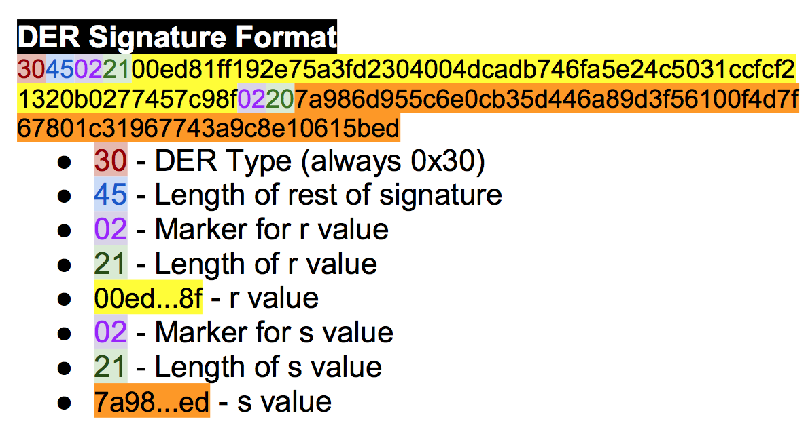

# DER Signatures

Another class that we need to learn to serialize are signatures. Much like the SEC format, it needs to encode two different numbers, r and s. Unfortunately, unlike S256Point, Signature cannot be compressed as s cannot be derived solely from r.

The standard for serializing signatures is called DER format. DER stands for Distinguished Encoding Rules and was used by Satoshi to create Bitcoin. This was most likely because the standard was already defined in 2008 and it was easy enough to adopt, rather than creating a new standard.

DER Signatures are created like this:

1. Start with the 0x30 byte
2. Encode the length of the rest of the signature (usually 0x44 or 0x45) and append
3. Append the marker byte (0x02)
4. Encode r as a big endian integer, but prepend with 0x00 byte if r's first byte >= 0x80. Add this to the result
5. Append the marker byte (0x02)
6. Encode s as a big endian integer, but prepend with 0x00 byte if s's first byte >= 0x80. Add this to the result



Because we know r is a 256-bit integer, r will be at most 32-bytes expressed as big-endian. It's also possible the first byte could be >= 0x80, so part 4 can be at most 33-bytes. However, if r is a relatively small number, it could be less than 32 bytes. Same goes for s and part 6.

Here's how this is coded in Python:

```python
class Signature:
...
    def der(self):
        rbin = self.r.to_bytes(32, byteorder='big')
        # remove all null bytes at the beginning
        rbin = rbin.lstrip(b'\x00')
        # if rbin has a high bit, add a \x00
        if rbin[0] & 0x80:
            rbin = b'\x00' + rbin
        result = bytes([2, len(rbin)]) + rbin  # <1>
        sbin = self.s.to_bytes(32, byteorder='big')
        # remove all null bytes at the beginning
        sbin = sbin.lstrip(b'\x00')
        # if sbin has a high bit, add a \x00
        if sbin[0] & 0x80:
            sbin = b'\x00' + sbin
        result += bytes([2, len(sbin)]) + sbin
        return bytes([0x30, len(result)]) + result
```
<1> In Python 3, you can convert a list of numbers to the byte equivalents using bytes([some_integer1, some_integer2])

Overall, this is an inefficient way to encode r and s as there are at least 4 bytes that aren't necessary.

### Try it

#### Verify the DER signature for the hash of "ECDSA is awesome!" for the given SEC pubkey

`z = int.from_bytes(double_sha256('ECDSA is awesome!'), 'big')`

Public Key in SEC Format: 
0204519fac3d910ca7e7138f7013706f619fa8f033e6ec6e09370ea38cee6a7574

Signature in DER Format: 304402201f62993ee03fca342fcb45929993fa6ee885e00ddad8de154f268d98f083991402201e1ca12ad140c04e0e022c38f7ce31da426b8009d02832f0b44f39a6b178b7a1


```python
from ecc import S256Point, Signature
from helper import double_sha256

der = bytes.fromhex('304402201f62993ee03fca342fcb45929993fa6ee885e00ddad8de154f268d98f083991402201e1ca12ad140c04e0e022c38f7ce31da426b8009d02832f0b44f39a6b178b7a1')
sec = bytes.fromhex('0204519fac3d910ca7e7138f7013706f619fa8f033e6ec6e09370ea38cee6a7574')

# message is the double_sha256 of the message "ECDSA is awesome!"
z = int.from_bytes(double_sha256(b'ECDSA is awesome!'), 'big')

# parse the der format to get the signature
# parse the sec format to get the public key

# use the verify method on S256Point to validate the signature
```
